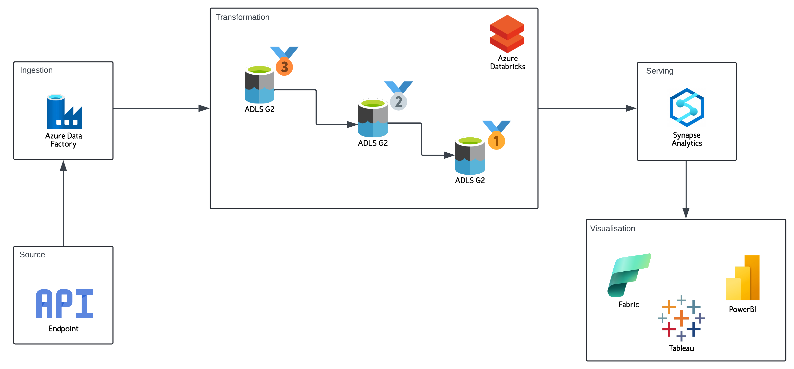

# Earthquake Azure Data Engineering Pipeline

## Project Description

This project is a fully automated, scalable data engineering pipeline built on Microsoft Azure designed to ingest, process, store, and analyze earthquake data sourced from the USGS Earthquake API. It leverages Azure Data Factory, Azure Databricks, Azure Data Lake Storage (ADLS Gen2), and Azure Synapse Analytics to provide a robust platform for seismic data management and insights.

The pipeline employs a **medallion architecture** (bronze, silver, gold layers) to progressively clean, enrich, and aggregate raw earthquake data into actionable formats tailored for government agencies, research institutions, and insurers. This modular architecture ensures data quality, facilitates efficient querying, and supports real-time reporting needs.

Key features include:

* **Automated Data Ingestion:** Uses Azure Data Factory to schedule and orchestrate daily extraction of seismic event data from the USGS API.
* **Scalable Data Processing:** Utilizes Azure Databricks to process raw JSON data into structured Parquet files following bronze (raw), silver (cleaned), and gold (aggregated) layers.
* **Hierarchical Storage:** Implements Azure Data Lake Storage Gen2 with separate containers for each medallion layer, enabling organized, performant data storage.
* **Advanced Analytics:** Integrates Azure Synapse Analytics for serverless querying over Parquet datasets, enabling complex aggregations and summarizations.
* **Extensible Visualization:** Supports data visualization through Power BI or Synapse SQL, empowering stakeholders with timely, interactive seismic insights.
* **Secure and Managed Access:** Implements role-based access controls and managed identities to securely connect and orchestrate services.

This pipeline streamlines the end-to-end earthquake data lifecycle, transforming raw API data into business-ready intelligence with minimal manual intervention, high reliability, and the ability to handle large-scale data volumes.
